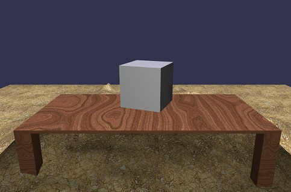

# Rainbow
An experiment in bringing together React style programming and 3D environments using BabylonJS.

## Basic model
The basic design is much like [ReactJS](https://github.com/reactjs) (and should 
probably just be updated to use React's engine. You implement a `render` function
and in there return a pure JS object DOM. At each frame, your method will be called
and the runtime will diff the DOM against the current state and update the UI to
match with minimal cost. 

```js
var App;
(function (App) {
    var R = Rainbow;
    var root = {
        // Update model on each frame tick
        // 
        updateModel: function (frameNumber, model) {
            return model;
        },
        // Create initial state of model
        // 
        initialize: function () {
            return { hover: "" };
        },
        // Update model in response to clicking
        // 
        clicked: function (model) {
            return model;
        },
        // Create the scene graph for a current point in time
        //    
        render: function (frameNumber, model, data) {
            // Normally only the camera and ground are position relative
            // to $origin, but for a simple starter, we don't have a ground
            //
            return [
                {
                    name: 'camera1',
                    type: 'freeCamera',
                    position: { x: 0, y: 10, z: -17 },
                    relativeTo: "$origin",
                    target: { x: 0, y: 5, z: 0 },
                    attachControl: "renderCanvas"
                },
                {
                    name: 'light1',
                    type: 'pointLight',
                    position: { x: 0, y: 0, z: 0 },
                    relativeTo: "$camera",
                    intensity: .7,
                    diffuse: { r: .9, g: .9, b: 1 },
                    specular: { r: 1, g: 1, b: 1 }
                },
                {
                    type: 'box',
                    name: 'shape1',
                    size: 3,
                    position: { x: 0, y: 0, z: 0 },
                    rotation: { x: frameNumber / 120, y: -.5, z: -.5 },
                    relativeTo: "$origin"
                }
            ];
        }
    };
    // Simplistic startup, need to think about the app bootstrap and actual app model.
    // Lots of questions - for example should we embrace React for the HTML UI and just go all in?
    //
    window.addEventListener("load", (function () {
        var canvas = document.getElementById("renderCanvas");
        R.Runtime.start(canvas, root);
    }));
})(App || (App = {}));

```


## A note about position and relativeTo
All objects in the system should be relativeTo another object. The design is to model
after holograms, where they are always "pinned" to an object in 3D space. The only exception
(in holograms) is the surface reconstruction - that is pinned to the real world. Since
we don't have actual reconstructed surfaces, the `"$origin"` hack denotes objects positioned in
fixed space. `"$camera"` will position objects relative to your camera, which is the equivalent 
of pinning an object to the user's eyes.

The 'correct' way of using Rainbow is to leverage the world construction module, this tries 
to simulate HoloLens surface reconstruction.

```js
var App;
(function (App) {
    var R = Rainbow;
    var root = {
        render: function (frameNumber, model, data) {
            return [
                {
                    type: 'box',
                    name: 'shape1',
                    size: 3,
                    rotation: { x: 0, y: frameNumber / 60, z: 0 },
                    position: { x: data.position.x, y: data.position.y + 2, z: data.position.z },
                    relativeTo: data.relativeTo
                }
            ];
        }
    };
    window.addEventListener("load", (function () {
        var canvas = document.getElementById("renderCanvas");
        R.Runtime.start(canvas, R.World.make(root));
    }));
})(App || (App = {}));
```


The key line here is `R.World.make(root)` which creates the surfaces representing the physical world
and calls into your 3D renderer. You now can skip creating lights, cameras, and the ground. The data
model must have a `relativeTo` and `position` members which are used to push the information about
where in the world you are expected to place your "holograms".


## Functional evaluation
Of course, since it's pure JS objects, you create create these with functions.

```js
function light(name) {
    return {
        name: name,
        type: 'directionalLight',
        position: { x: 5, y: 5, z: -10 },
        direction: {x:-1, y:-1, z:10},
        intensity: .7,
        diffuse: {r:.9, g:.9, b:1},
        specular: {r:1, g:1, b:1},
    };
}
function sphere(name, size, x, y, z) {
    return {
        name: name,
        type: 'sphere',
        position: { x: x, y: y, z: z },
        size: size
    };
}

function render() {
    return [
        {
            name: 'camera1',
            type: 'freeCamera',
            position: { x: 5, y: 5, z: -10 },
            target: {x:0, y:0, z:0}
        },
        light('light1'),
        sphere('sphere1', 3, 0, 0, 0) 
    ];
};
```

## Animation
There is a very rudimentary animation system which allows for simple property tweening over time.

```js
var App;
(function (App) {
    var R = Rainbow;
    var root = {
        render: function (frameNumber, model, data) {
            return [
                {
                    type: 'box',
                    name: 'shape1',
                    size: 1,
                    
                    // initial state
                    //
                    rotation: { x: 0, y: 0, z: 0 },
                    scaling: { x: .1, y: .1, z: .1 },
                    position: { x: data.position.x, y: data.position.y + 2, z: data.position.z },
                    relativeTo: data.relativeTo,
                    
                    // animation
                    //
                    animation: {
                        rotation: { x: 3, y: 3, z: 3 },
                        rotationVelocity: .05,
                        scaling: { x: 3, y: 3, z: 3 },
                        scalingVelocity: .05,
                        position: {
                            x: data.position.x + ((frameNumber / 30) | 0) % 10,
                            y: data.position.y + 4 + ((frameNumber / 50) | 0) % 3,
                            z: data.position.z + ((frameNumber / 20) | 0) % 10
                        },
                        velocity: .3
                    }
                }
            ];
        }
    };
    window.addEventListener("load", (function () {
        var canvas = document.getElementById("renderCanvas");
        R.Runtime.start(canvas, R.World.make(root));
    }));
})(App || (App = {}));
```    

Velocity properties controls the maximum change per frame, and the property values is the target 
(from wherever the value is currently).


## More?
There is more, but at this point the hacking is much faster than the documenting... 

## Contributing
Just starting to figure this out, see [contributing.md](contributing.md)


