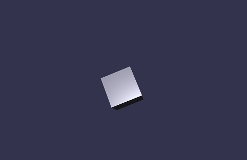

# React & BabylonJS (RNB)
An experiment in bringing together React style programming and 3D environments.

## Basic model
The basic design is much like [ReactJS](https://github.com/reactjs) (and should 
probably just be updated to use React's engine. You implement a `render` function
and in there return a pure JS object DOM. At each frame, your method will be called
and the runtime will diff the DOM against the current state and update the UI to
match with minimal cost. 

```js
var App;
(function (App) {
    var R = Rainbow;

    // Update model on each frame tick
    // 
    function updateModel(frameNumber, model) { return model; }

    // Create initial state of model
    // 
    function initialize() { return { hover: "" }; }

    // Update model in response to clicking
    // 
    function clicked(model) { return model; }

    // Create the scene graph for a current point in time
    //    
    function render(frameNumber, model) {
        return [
            {
                name: 'camera1',
                type: 'freeCamera',
                position: { x: 0, y: 10, z: -17 },
                relativeTo: "$origin",
                target: { x: 0, y: 5, z: 0 },
                attachControl: "renderCanvas"
            },
            {
                name: 'light1',
                type: 'pointLight',
                position: { x: 0, y: 0, z: 0 },
                relativeTo: "$camera",
                intensity: .7,
                diffuse: { r: .9, g: .9, b: 1 },
                specular: { r: 1, g: 1, b: 1 }
            },
            {
                type: 'box',
                name: 'shape1',
                size: 3,
                position: { x: 0, y: 0, z: 0 },
                rotation: { x:frameNumber/120, y:-.5, z:-.5 },
                relativeTo: "$origin"
            }
        ];
    }

    window.addEventListener("load", (function () {
        var canvas = document.getElementById("renderCanvas");
        R.Runtime.start(canvas, initialize, clicked, updateModel, render);
    }));
})(App || (App = {}));
```


## A note about position and relativeTo
All objects in the system should be relativeTo another object. The design is to model
after holograms, where they are always "pinned" to an object in 3D space. The only exception
(in holograms) is the surface reconstruction - that is pinned to the real world. Since
we don't have actual reconstructed surfaces, the "$origin" hack denotes objects positioned in
fixed space. "$camera" will position objects relative to your camera, which is the equivalent
of pinning an object to the user's eyes.


## Functional evaluation
Of course, since it's pure JS objects, you create create these with functions.

```js
function light(name) {
    return {
        name: name,
        type: 'directionalLight',
        position: { x: 5, y: 5, z: -10 },
        direction: {x:-1, y:-1, z:10},
        intensity: .7,
        diffuse: {r:.9, g:.9, b:1},
        specular: {r:1, g:1, b:1},
    };
}
function sphere(name, size, x, y, z) {
    return {
        name: name,
        type: 'sphere',
        position: { x: x, y: y, z: z },
        size: size
    };
}

function render() {
    return [
        {
            name: 'camera1',
            type: 'freeCamera',
            position: { x: 5, y: 5, z: -10 },
            target: {x:0, y:0, z:0}
        },
        light('light1'),
        sphere('sphere1', 3, 0, 0, 0) 
    ];
};
```

## More?
There is more, but at this point the hacking is much faster than the documenting... 

## Contributing
Not yet supported, right now it's just me hacking

